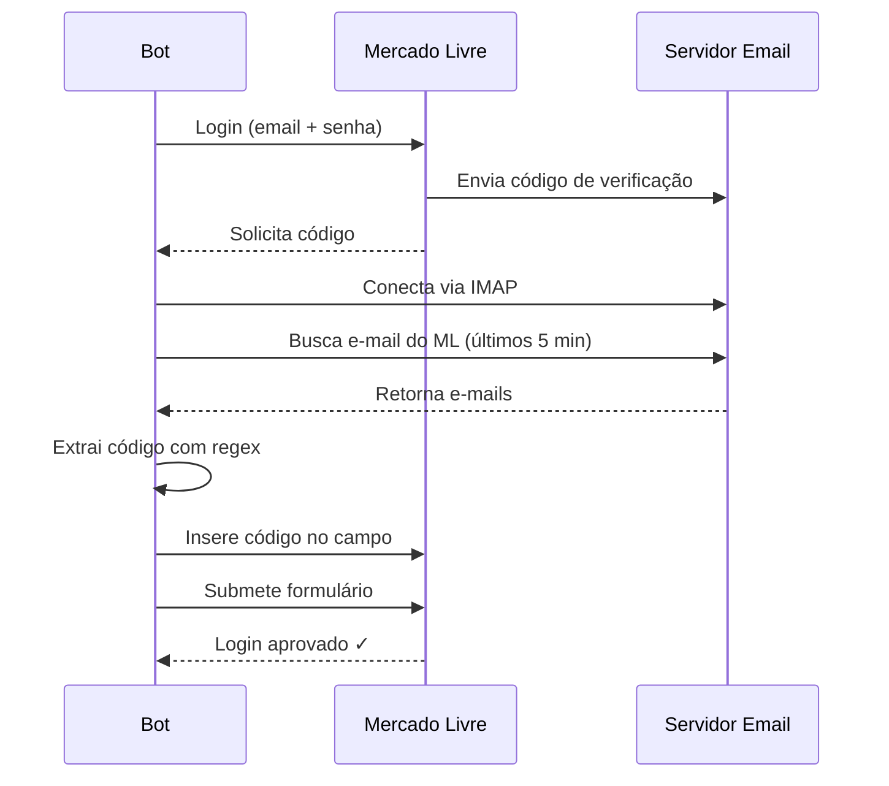

# 📧 Configuração de E-mail para Verificação 2FA

Este guia explica como configurar o acesso ao e-mail para buscar automaticamente códigos de verificação do Mercado Livre.

## 📋 Por que isso é necessário?

Quando você faz login no Mercado Livre, o site pode solicitar um código de verificação enviado por e-mail (autenticação de 2 fatores). Este módulo busca esse código automaticamente no seu e-mail e o insere no site.

## ⚙️ Configuração - Gmail (Recomendado)

### 1️⃣ Habilitar IMAP no Gmail

1. Acesse [Gmail](https://mail.google.com)
2. Clique em **Configurações** (⚙️) → **Ver todas as configurações**
3. Vá em **Encaminhamento e POP/IMAP**
4. Ative **Ativar IMAP**
5. Clique em **Salvar alterações**

### 2️⃣ Criar Senha de App (Obrigatório)

O Gmail não permite login com senha normal para aplicativos. Você precisa criar uma "Senha de app".

**Passo a passo:**

1. Acesse sua [Conta Google](https://myaccount.google.com/)
2. Vá em **Segurança**
3. Ative **Verificação em duas etapas** (se ainda não estiver)
4. Volte em **Segurança** → **Senhas de app**
   - Link direto: https://myaccount.google.com/apppasswords
5. Selecione:
   - **App:** Outro (nome personalizado)
   - **Nome:** Bot Mercado Livre
6. Clique em **Gerar**
7. **Copie a senha de 16 caracteres** gerada

### 3️⃣ Configurar no account.txt

Edite o arquivo [account.txt](account.txt) e adicione:

```
login = seu_email_mercadolivre@exemplo.com
password = sua_senha_mercadolivre

email = seu_email@gmail.com
email_password = abcd efgh ijkl mnop
```

**⚠️ IMPORTANTE:**
- `login` e `password` = Credenciais do Mercado Livre
- `email` = Seu Gmail (mesmo que o login do ML ou diferente)
- `email_password` = A senha de app de 16 caracteres (pode ter espaços)

### 4️⃣ Testar Conexão

```bash
python utils/email_handler.py
```

Você deve ver:
```
✓ Conectado ao e-mail: seu_email@gmail.com
```

## 🔧 Configuração - Outros Provedores

### Outlook/Hotmail

**IMAP Server:** `outlook.office365.com`

1. Acesse [Outlook](https://outlook.live.com)
2. **Configurações** → **Ver todas as configurações**
3. **E-mail** → **Sincronizar e-mail**
4. Ative **Permitir que dispositivos e aplicativos usem POP**

No [account.txt](account.txt):
```
email = seu_email@outlook.com
email_password = sua_senha_outlook
```

### Yahoo Mail

**IMAP Server:** `imap.mail.yahoo.com`

1. Acesse [Yahoo Account Security](https://login.yahoo.com/account/security)
2. Adicione **Senha de app**
3. Use essa senha no account.txt

No [account.txt](account.txt):
```
email = seu_email@yahoo.com
email_password = senha_de_app_yahoo
```

## 🧪 Como Testar

### Teste 1: Conexão Básica

```bash
cd utils
python email_handler.py
```

**Resultado esperado:**
```
🔌 Conectando ao servidor IMAP: imap.gmail.com
✓ Conectado ao e-mail: seu_email@gmail.com
✓ Desconectado do e-mail
```

### Teste 2: Buscar Código do Mercado Livre

1. Faça login manual no Mercado Livre
2. Solicite código de verificação por e-mail
3. Execute:

```python
from utils.email_handler import EmailHandler, load_email_credentials

email_addr, email_pass = load_email_credentials()
handler = EmailHandler(email_addr, email_pass)

if handler.connect():
    code = handler.get_verification_code_from_mercadolivre(max_attempts=5)
    if code:
        print(f"Código encontrado: {code}")
    handler.disconnect()
```

### Teste 3: Login Automático com 2FA

```bash
python affiliate.py
```

O sistema deve:
1. ✅ Fazer login no Mercado Livre
2. ✅ Detectar solicitação de código
3. ✅ Buscar código no e-mail
4. ✅ Inserir código automaticamente
5. ✅ Completar login

## 🐛 Resolução de Problemas

### Erro: "Authentication failed"

**Causa:** Senha incorreta ou IMAP desabilitado

**Solução Gmail:**
1. Verifique se usou a senha de app (não a senha normal)
2. Verifique se IMAP está habilitado
3. Remova espaços extras da senha no account.txt

**Solução Outlook:**
1. Use a senha normal da conta
2. Ative "Permitir aplicativos menos seguros"

### Erro: "Código não encontrado"

**Possíveis causas:**

1. **E-mail ainda não chegou**
   - O bot espera até 1 minuto (12 tentativas × 5 segundos)
   - Aumente `max_attempts` se necessário

2. **Filtro de busca muito restrito**
   - Verifica e-mails dos últimos 5 minutos
   - Apenas remetentes com "mercadolivre" no endereço

3. **Formato do código não reconhecido**
   - O bot busca códigos de 4-8 dígitos
   - Padrões: `123456`, `código: 123456`, etc.

**Soluções:**

```python
# Aumentar tempo de espera
code = handler.get_verification_code_from_mercadolivre(
    max_attempts=20,  # 20 tentativas
    wait_seconds=10   # 10 segundos entre tentativas
)
```

### Erro: "Connection refused" / "Timeout"

**Causa:** Firewall ou antivírus bloqueando conexão IMAP

**Solução:**
1. Desative temporariamente antivírus/firewall
2. Verifique se a porta 993 (IMAP SSL) está aberta
3. Tente de outra rede (problema pode ser do ISP)

### E-mail configurado mas não funciona

**Verificações:**

```python
# Teste manual de conexão
import imaplib
mail = imaplib.IMAP4_SSL('imap.gmail.com')
mail.login('seu_email@gmail.com', 'sua_senha_de_app')
mail.select('INBOX')
print("Conectado com sucesso!")
mail.logout()
```

### Código inserido mas não aceito

**Causas possíveis:**
1. Código expirado (geralmente válido por 10 minutos)
2. Código incorreto (regex pegou número errado)
3. Campo de entrada incorreto

**Debug:**
- Execute com `headless=False` para ver o navegador
- Verifique o código extraído manualmente no e-mail

## 🔒 Segurança

### ✅ Boas Práticas

1. **Use Senha de App** (Gmail)
   - Nunca use sua senha principal
   - Senhas de app podem ser revogadas facilmente

2. **Proteja account.txt**
   - Já está no `.gitignore`
   - Nunca compartilhe este arquivo

3. **Permissões Mínimas**
   - A senha de app só precisa de acesso a e-mail
   - Não dá acesso a outras configurações da conta

4. **Monitore Acessos**
   - Gmail: https://myaccount.google.com/device-activity
   - Verifique acessos suspeitos regularmente

### ⚠️ Avisos

- 🚫 **Nunca** compartilhe senha de app
- 🚫 **Nunca** versione account.txt com dados reais
- 🚫 **Nunca** deixe credenciais em código
- ✅ **Sempre** use senhas de app quando disponível
- ✅ **Sempre** revogue senhas não utilizadas

## 📊 Como Funciona



## 🎯 Fluxo Completo

1. **Bot tenta login** no Mercado Livre
2. **ML solicita verificação** 2FA
3. **Bot detecta** solicitação de código
4. **Bot clica** em "Enviar por e-mail" (se disponível)
5. **Bot conecta** ao servidor IMAP
6. **Bot busca** e-mails do ML (últimos 5 min)
7. **Bot extrai** código usando regex
8. **Bot insere** código no campo
9. **Bot submete** e completa login

## 💡 Dicas

### Performance

- Configure `headless=True` para execução mais rápida
- Reduza `max_attempts` se o e-mail chega rápido
- Use WiFi estável (3G/4G pode ter delays)

### Debugging

Execute com navegador visível:

```python
from affiliate import create_affiliate_driver, login_mercado_livre

driver = create_affiliate_driver(headless=False)
email = "seu_email@mercadolivre.com"
senha = "sua_senha"

login_mercado_livre(driver, email, senha, handle_2fa=True)

# Navegador fica aberto para debug
input("Pressione Enter para fechar...")
driver.quit()
```

### Alternativa Manual

Se a automação falhar, você pode:

1. Deixar `handle_2fa=False`
2. Inserir código manualmente quando solicitado
3. O bot aguardará 60 segundos

```python
login_mercado_livre(driver, email, senha, handle_2fa=False)
```

## 📚 Referências

- [Gmail IMAP Settings](https://support.google.com/mail/answer/7126229)
- [Gmail App Passwords](https://support.google.com/accounts/answer/185833)
- [Outlook IMAP](https://support.microsoft.com/en-us/office/pop-imap-and-smtp-settings-8361e398-8af4-4e97-b147-6c6c4ac95353)
- [Python imaplib](https://docs.python.org/3/library/imaplib.html)

---

💡 **Dica Final:** Se você usa Gmail, a configuração leva menos de 5 minutos! Siga os passos do Gmail acima e está pronto para usar. 🚀
