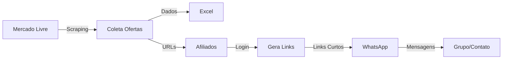

# 🤖 Bot de Ofertas Mercado Livre + Afiliados + WhatsApp

[](https://www.python.org/)
[](https://www.selenium.dev/)
[](https://www.docker.com/)
[](https://podman.io/)

Bot automatizado que coleta ofertas do Mercado Livre, gera links de afiliado e envia mensagens promocionais no WhatsApp.

## ✨ Funcionalidades

- 🔍 **Scraping Automatizado**: Coleta ofertas do Mercado Livre
- 🔗 **Links de Afiliado**: Gera links de afiliado automaticamente
- � **Verificação 2FA**: Busca códigos de verificação no e-mail automaticamente
- �📱 **WhatsApp**: Envia mensagens promocionais
- 📊 **Excel**: Exporta dados em planilha
- 🐳 **Containerizado**: Suporte completo para Docker/Podman
- 🐧 **Multi-plataforma**: Windows, Linux, macOS

## 🚀 Início Rápido

### Opção 1: Com Podman/Docker (Recomendado para Linux)

```bash
# Linux/macOS
chmod +x run-podman.sh
./run-podman.sh

# Windows
run-podman.bat
```

**Ou usando Makefile:**

```bash
make setup    # Configura o projeto
make run      # Executa o bot em container
```

### Opção 2: Instalação Local

```bash
# 1. Instalar dependências
pip install -r requirements.txt

# 2. Configurar credenciais
# Edite account.txt com suas credenciais do Mercado Livre

# 3. Executar
python run_bot.py
```

## 📋 Pré-requisitos

### Para uso local:
- Python 3.8+
- Google Chrome instalado
- ChromeDriver (incluído no projeto)

### Para uso com container:
- [Podman](https://podman.io/getting-started/installation) ou [Docker](https://docs.docker.com/get-docker/)
- (Opcional) Make para usar o Makefile

## 📖 Documentação

- 📘 [Manual de Uso Completo](MANUAL_USO.md) - Guia detalhado de todas as funcionalidades
- 🐳 [Guia Podman/Docker](PODMAN_GUIDE.md) - Como usar com containers Linux
- 📧 [Configuração 2FA por E-mail](EMAIL_2FA_SETUP.md) - Automatizar verificação de código

## ⚙️ Configuração

### 1. Credenciais de Afiliado

Edite [account.txt](account.txt):

```
login = seu_email@mercadolivre.com
password = sua_senha_segura

# Para verificação 2FA automática (opcional)
email = seu_email@gmail.com
email_password = sua_senha_de_app_gmail
```

**⚠️ Verificação 2FA:**
Se o Mercado Livre solicitar código de verificação, o bot pode buscá-lo automaticamente no seu e-mail. 

📘 **[Guia Completo de Configuração de E-mail](EMAIL_2FA_SETUP.md)**

### 2. Configurar Bot

Edite [run_bot.py](run_bot.py):

```python
WHATSAPP_NUMBER = "+5511999999999"  # Seu número/grupo
MAX_PAGES = 2                        # Páginas para coletar
USE_AFFILIATE = True                 # Gerar links de afiliado
SEND_WHATSAPP = False               # Ativar envio WhatsApp
```

## 🐳 Uso com Podman/Docker

### Comandos Rápidos

```bash
# Construir imagem
make build

# Rodar bot
make run

# Rodar testes
make test

# Shell interativo
make shell

# Limpar tudo
make clean-all

# Ver ajuda
make help
```

### Docker Compose

```bash
# Iniciar
docker compose up --build

# Parar
docker compose down
```

## 📁 Estrutura do Projeto

```
Python_Divulg_Whats/
├── 📄 bot.py                    # Bot original de coleta
├── 📄 bot_integrated.py         # Bot completo integrado
├── 📄 affiliate.py              # Módulo de links de afiliado
├── 📄 whatsapp_sender.py        # Módulo de envio WhatsApp
├── 📄 run_bot.py                # Script principal de execução
├── 📄 test_setup.py             # Testes de configuração
├── 📄 base.py                   # Exemplos básicos
│
├── 🐳 Dockerfile                # Imagem Docker/Podman
├── 🐳 docker-compose.yml        # Orquestração de containers
├── 🐳 run-podman.sh             # Script de execução (Linux/macOS)
├── 🐳 run-podman.bat            # Script de execução (Windows)
├── 📝 Makefile                  # Comandos facilitados
│
├── 📁 utils/
│   ├── support.py               # Funções auxiliares Selenium
│   ├── email_handler.py         # Handler de e-mail para 2FA
│   ├── environment.py           # Detecção de ambiente
│   ├── chromedriver-linux64/    # ChromeDriver Linux
│   └── chromedriver-win64/      # ChromeDriver Windows
│
├── 📁 outputs/                  # Arquivos Excel gerados
├── 📄 account.txt               # Credenciais (não versionar!)
├── 📄 account.txt.example       # Exemplo de credenciais
├── 📄 requirements.txt          # Dependências Python
│
└── 📚 Documentação
    ├── PODMAN_GUIDE.md          # Guia de containers
    └── EMAIL_2FA_SETUP.md       # Configuração 2FA
    ├── MANUAL_USO.md            # Manual completo
    └── PODMAN_GUIDE.md          # Guia de containers
```

## 🎯 Fluxo de Funcionamento



1. 🔍 **Coleta** ofertas do Mercado Livre
2. 💾 **Salva** dados em Excel
3. 🔐 **Login** na conta de afiliado
4. 🔗 **Gera** links de afiliado
5. 📱 **Formata** mensagens promocionais
6. 📤 **Envia** no WhatsApp

## 🛠️ Comandos Úteis

### Local

```bash
# Testar configuração
python test_setup.py

# Rodar bot completo
python run_bot.py

# Rodar apenas scraping
python bot.py

# Testar afiliados
python affiliate.py

# Testar WhatsApp
python whatsapp_sender.py
```

### Container

```bash
# Build e run
make run

# Apenas build
make build

# Testes
make test

# Shell interativo
make shell

# Ver logs
make logs

# Limpar
make clean
```

## 🔧 Resolução de Problemas

### ChromeDriver não encontrado

O projeto já inclui o ChromeDriver. Se houver erro:

**Local:**
```bash
# Windows: usa chromedriver-win64/
# Linux: usa chromedriver-linux64/
```

**Container:**
Usa automaticamente o ChromeDriver Linux incluído na imagem.

### Erro de credenciais

Certifique-se de ter editado [account.txt](account.txt) corretamente:

```bash
# Ver se está configurado
cat account.txt

# C

### Verificação 2FA não funciona

Se o código de verificação não for encontrado automaticamente:

1. **Verifique configuração de e-mail** no [account.txt](account.txt)
2. **Consulte o guia completo**: [EMAIL_2FA_SETUP.md](EMAIL_2FA_SETUP.md)
3. **Use verificação manual**: O bot aguarda 60s para entrada manual
4. **Teste a conexão**:
   ```bash
   python utils/email_handler.py
   ```opiar do exemplo
cp account.txt.example account.txt
```

### WhatsApp não abre

- Certifique-se de ter o WhatsApp Web configurado
- O pywhatkit abre automaticamente uma aba do navegador
- Aguarde até a mensagem ser enviada

### Container não inicia

```bash
# Ver logs
docker logs bot-mercadolivre

# Rebuild sem cache
docker build --no-cache -t bot-mercadolivre:latest .

# Verificar permissões (Linux)
chmod +x utils/chromedriver-linux64/chromedriver
```

## 📊 Exemplos de Saída

### Console

```
============================================================
🤖 BOT DE OFERTAS MERCADO LIVRE + AFILIADOS + WHATSAPP
============================================================

PASSO 1: Coletando ofertas do Mercado Livre
============================================================
✓ Página de ofertas carregada
📄 Total de páginas a coletar: 2
🔍 Coletando página 1 de 2...
✓ Coletados 20 produtos da página 1

PASSO 2: Gerando links de afiliado
============================================================
✓ Credenciais carregadas
Login realizado com sucesso!
Gerando links de afiliado para 20 produtos...
✓ 20 links de afiliado gerados com sucesso!

✅ BOT FINALIZADO COM SUCESSO!
📁 Arquivo salvo: ofertas_dia_2026-02-09.xlsx
```

### Excel Gerado

| Produtos | Preço | Preço anterior | Desconto | Link |
|----------|-------|----------------|----------|------|
| iPhone 13 128GB | R$ 3.499,00 | R$ 4.099,00 | 15% OFF | [Link](https://mercadolivre.com/sec/...) |
| Notebook Dell | R$ 2.899,00 | R$ 3.599,00 | 20% OFF | [Link](https://mercadolivre.com/sec/...) |

## 🤝 Contribuindo

Contribuições são bem-vindas! Sinta-se livre para:

1. 🐛 Reportar bugs
2. 💡 Sugerir melhorias
3. 🔀 Enviar pull requests
4. ⭐ Dar uma estrela no projeto

## ⚠️ Avisos Importantes

1. **Rate Limiting**: Não execute com muita frequência
2. **WhatsApp**: Respeite as políticas para evitar banimento
3. **Credenciais**: NUNCA versione o arquivo `account.txt`
4. **Uso Ético**: Respeite os termos de serviço

## 📝 Licença

Este projeto é fornecido "como está" para fins educacionais.

## 👤 Autor

**KvnBarrios**

---

## 🌟 Recursos Adicionais

- 📘 [Documentação Selenium](https://www.selenium.dev/documentation/)
- 📱 [PyWhatKit Docs](https://github.com/Ankit404butfound/PyWhatKit)
- 🐳 [Podman Documentation](https://docs.podman.io/)
- 🔗 [Mercado Livre Afiliados](https://www.mercadolivre.com.br/afiliados)

## 📞 Suporte

Se encontrar problemas:

1. Verifique o [Manual de Uso](MANUAL_USO.md)
2. Consulte o [Guia Podman](PODMAN_GUIDE.md) para containers
3. Execute `python test_setup.py` para diagnosticar
4. Abra uma [Issue](../../issues) no GitHub

---

⭐ **Se este projeto foi útil, considere dar uma estrela!** ⭐
